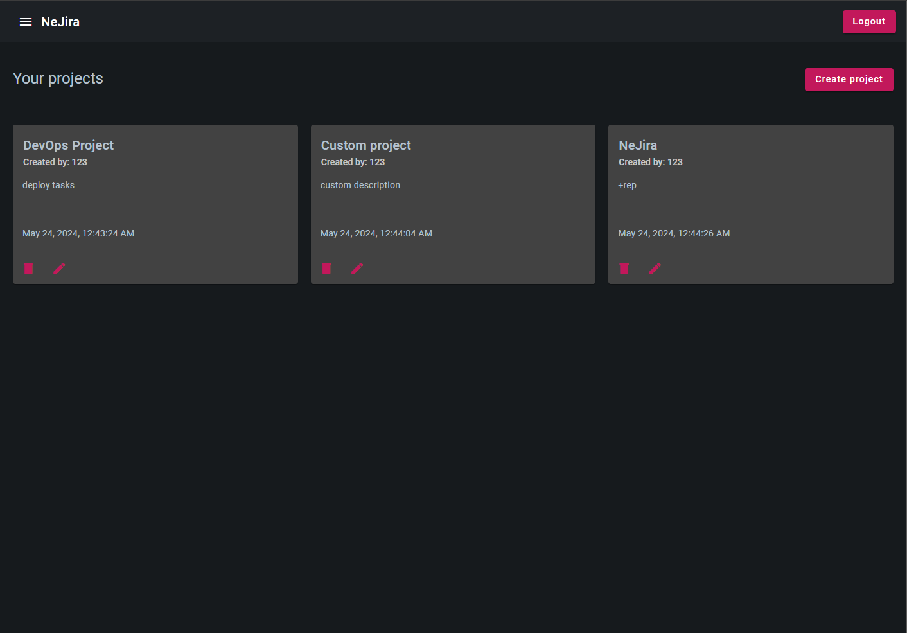
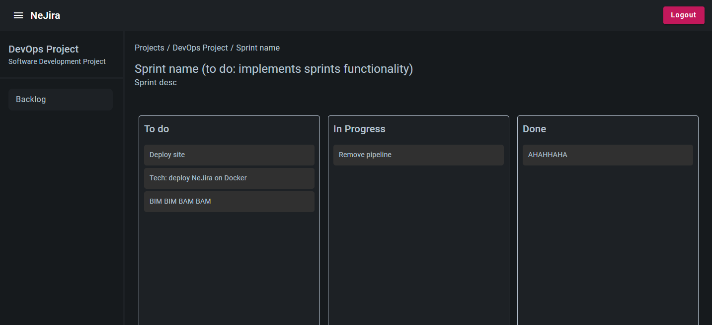
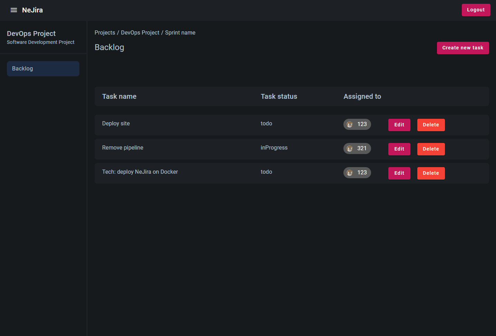

# Title  
Богоподобный клон Jira. Angular 16 + Express 

Реализована авторизация через jwt, CRUD.
Захардкожен за 2 дня, прошу не судить строго)

### TODO  
Develop sprints functionality.

## Screenshots  

Projects page

Board page

Backlog page

## Tech Stack

**Client:** Angular 16, Angular Material

**Server:** Node, Express, MongoDB

## Features  

- Auth 
- Work with projects  
- Work with tasks  
- Drag & Drop

## Run Locally  

Clone the project  

~~~bash  
  git clone https://github.com/nikitasvi/NeJira
~~~

Go to the project directory  

~~~bash  
  cd NeJira
~~~

Install dependencies  

~~~bash  
npm install
~~~

Start client  

~~~bash  
ng serve
~~~

Go to backend path 

~~~bash  
cd src/express
~~~

Start server  

~~~bash  
node server.js
~~~ 
